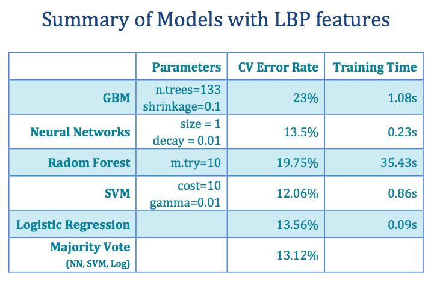

# Project: Labradoodle or Fried Chicken? In Black and White. 


### [Full Project Description](doc/project3_desc.html)

Term: Spring 2017

+ Team #4
+ Team members
	+ team member 1 ([`Qingyuan Zhang`](https://github.com/amandazhang))
	+ team member 2 ([`Zhilin   Fan`](https://github.com/zf2169))
	+ team member 3 ([`Yuxin    Zhu`](https://github.com/yz2986))
	+ team member 4 ([`Vanessa   Huang`](https://github.com/yhuang2017))
	+ team member 5 ([`Zishuo   Li`](https://github.com/ZishuoLi))

+ Project summary: In this project, we utilized deep learning packages in matlab to do feature extraction from given 2000 gray scale images of poodles and fried chicken. 
Then we applied machine learning tools to help build good classifier and make prediction on new images. We used the given 5000-dimensional SIFT features at our first attempt, but we only got 80% accuracy rate and the execution time was not satisfying. After some attempts, we used LBP(Local Binary Patterns) to extract features. The processing time of 2000 images is 210s and the dimension of feature matrix is 2000*59. We used GBM, BP Neural Networks, Random Forest, SVM and Logistic Regression for advanced models. 
Here is a summary of our models. 


We chose Majority Vote(BP Netural Networks, SVM, Logistic Regression) as our final model. Since training time of each model is very short, time won't be a problem for majority vote. Although we sacrifice little accuracy, We can get a more robust model.
	
**Contribution statement**: ([default](doc/a_note_on_contributions.md)) All team members contributed equally in all stages of this project. All team members approve our work presented in this GitHub repository including this contributions statement. 

Following [suggestions](http://nicercode.github.io/blog/2013-04-05-projects/) by [RICH FITZJOHN](http://nicercode.github.io/about/#Team) (@richfitz). This folder is orgarnized as follows.

```
proj/
├── lib/
├── data/
├── doc/
├── figs/
└── output/
```

Please see each subfolder for a README file.
